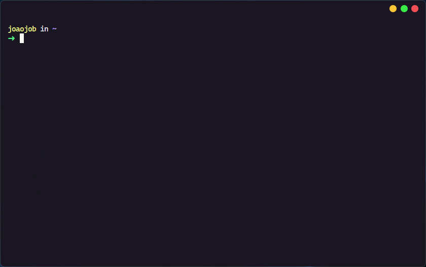

<h1 align="center">
  Hyper plugin to hide window title <br/> <br/>

  
  
</h1>

# About

If you're like me and only use one tab, the window title doesn't make much sense

# Preview



# Install


```
$ hyper i @joaogabrielfjob/hyper-hide-title
```
